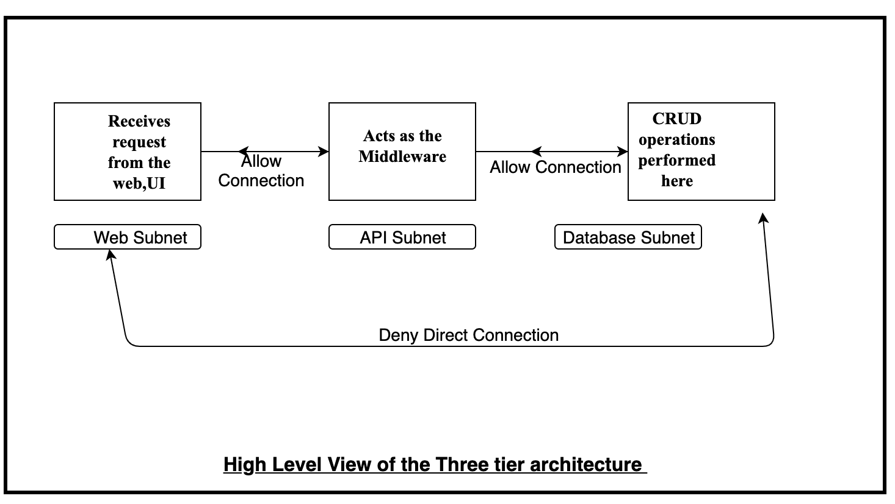
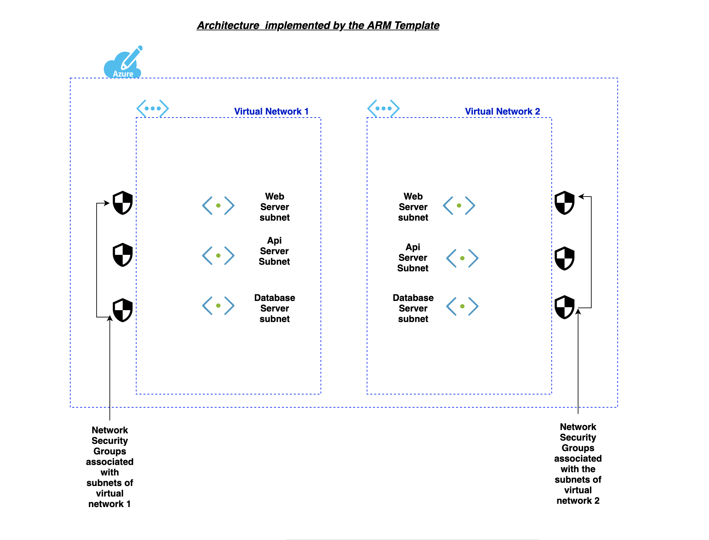
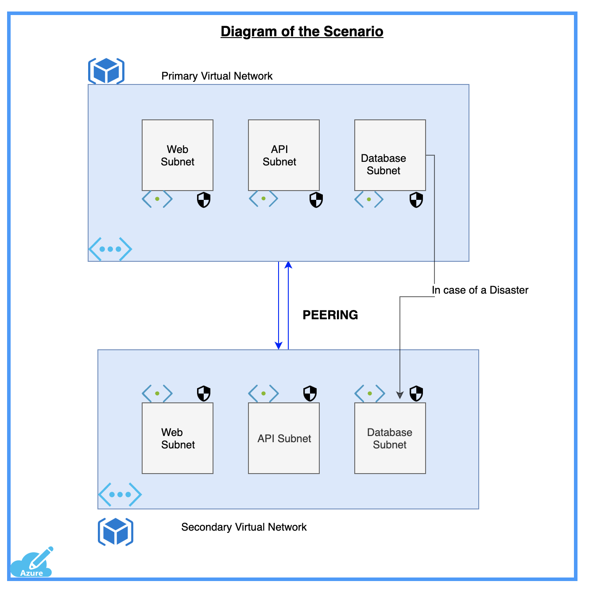

# Template to deploy  the Three tier Architecture


The three   architecture  is a basic model for developing a web database application and communication is done using this 3-level application logic.
The  database tier is  where data gets stored in a database server and is known as fully secure . Various CRUD operations are being performed here. Next is the Api layer inside the Api subnet which provides a communication between the web server and the data base server. Finally there is a web server which aacepts all the internet requests and send requests to the api server.
<p align="center">
</br>
Figure 1.1: High Level View of the Architecture 
</br></br>

Figure 1.2: Detailed Architecture in Azure


In this template  two virtual networks are created  with three subnets each and having three network security groups associated with the subnets.Also  Peering is enabled betwwen the two virtual networks.

Note: Incase of Disaster Recovery we are modifying the database NSG so that the database subnet of virtual network 1 can send its replica to database subnet of virtual network 2 through a specific port.

###  Detail of the Architecture implemented
<p allign="center">

Figure 1.3 High Level View of the Architecture </br>
</p>

## There are three ways to deploy an ARM template in Azure:
### <b>1. Using Deploy</b>

<a href="https://portal.azure.com/#create/Microsoft.Template/uri/https%3A%2F%2Fraw.githubusercontent.com%2Fdevyanshi-t%2FAzureResourceTemplate%2Fmaster%2FNestedTemplate%2Fmaster.json"  target="_blank">
 
</a>
<a href="http://armviz.io/#/?load=https%3A%2F%2Fraw.githubusercontent.com%2FAzure%2Fazure-quickstart-templates%2Fmaster%2F101-AAD-DomainServices%2Fazuredeploy.json" target="_blank">
 
</a></br>
Click on the deploy button above, you will be redirected  to Azure where you can fill in all the parameters in ARM template to create a Virtual Network.<br/>

###  <b>  2. Azure Command Line Interface(CLI)</b>

On the Azure CLI type the command  and then type in all the parameter values in the CLI. 
<br />
<a href="https://shell.azure.com" target="_blank">

</a>
</br>

```bash
az group deployment create --resource-group Resource group name --template-file file name
```
### <b> 3. PowerShell </b>
<br />
<a href="https://shell.azure.com" target="_blank">

</a>
</br>

```bash 
New-AzResourceGroupDeployment -ResourceGroupName resource-group-name -TemplateFile path-to-template 
```
Note: Do change the directory to home before executing the command.
<br/>Refer to the vnetparameter.json file to see the default values for the parameters .

## Author
[`Devyanshi Tiwari`](https://github.com/devyanshi-t)<br />

